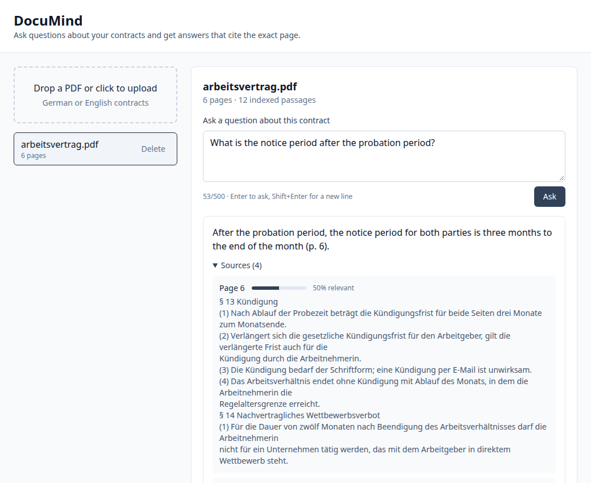

# DocuMind

[](https://github.com/Pikuz1/Documind/actions/workflows/ci.yml)

Ask questions about a German or English contract (PDF) and get a short answer that cites the exact page it came from — or a clear "I could not find this in the document" instead of a made-up one.



## Why

Employment, rental and freelance contracts are long, and in Germany often written in dense legal German. Ctrl+F only finds exact words: "When can I quit?" never matches a clause titled *Kündigungsfrist*. DocuMind searches by **meaning**, across languages, and shows the passages and page numbers behind every answer so you can check it yourself.

## Features

- Upload a PDF contract; it is split into passages and indexed locally.
- Ask in English or German, about a contract in either language; answers come back in the language of the question.
- Answers list their source passages with page number and relevance.
- Refuses to answer when nothing relevant is found — the language model is not even called.
- Uploaded files are not kept: only the extracted passages are stored, on your machine.
- Runs on Windows, macOS and Linux with one Docker command.

## How it works

```
 PDF ─► PyPDFLoader ─► RecursiveCharacterTextSplitter ─► multilingual embeddings ─► ChromaDB
        (1 Document     (800-char overlapping chunks,      (local, 384-dim)          (vectors +
         per page)       each tagged with page number)                                page metadata)
                                                                          └─► SQLite (documents, query log)

 question ─► embedding ─► top-4 chunks of this document (cosine similarity, metadata filter)
          ─► below relevance threshold? ─► "I could not find this in the document."
          ─► otherwise: prompt (passages + question) ─► Gemini ─► answer with (p. N) citations
```

This is **retrieval-augmented generation (RAG)**. Instead of sending a whole contract to a language model, DocuMind embeds every passage with a local multilingual model (`paraphrase-multilingual-MiniLM-L12-v2`), so a German clause and an English question about it end up close together in vector space. A question retrieves the four most similar passages of the selected document from ChromaDB. If none of them is relevant enough, the app answers "not found" without calling the model at all. Otherwise a strict prompt allows the model (Google Gemini) to answer only from those passages and to cite their pages.

## Tech stack

| Area | Tools |
|---|---|
| AI / retrieval | LangChain (loaders, splitters, LCEL chains), sentence-transformers, ChromaDB, Google Gemini |
| Backend | Python 3.12, FastAPI, Pydantic, SQLite |
| Frontend | React 19, TypeScript, Vite, Tailwind CSS |
| Testing | pytest (100% coverage), Vitest + Testing Library (100% coverage), Playwright |
| Delivery | Docker (multi-stage), Docker Compose, GitHub Actions (Linux, Windows, macOS) |

## Quick start (any OS)

1. Install [Docker Desktop](https://www.docker.com/products/docker-desktop/) (Windows, macOS) or Docker Engine (Linux).
2. Clone the repository:
   ```bash
   git clone https://github.com/Pikuz1/Documind.git && cd Documind
   ```
3. Copy `backend/.env.example` to `backend/.env` (required) and set `GOOGLE_API_KEY` to a free Gemini key from [Google AI Studio](https://aistudio.google.com/apikey).
   No key yet? Set `AI_PROVIDER=fake` instead to try the app with placeholder answers. Without either, the app stops at startup and tells you which one to set.
4. Start it:
   ```bash
   docker compose up --build
   ```
   The first build takes a few minutes. Then open <http://localhost:8000>.

Uploaded documents are indexed into a Docker volume (`app-data`), so they survive restarts. `docker compose down -v` removes them.

## Development setup (Ubuntu)

Backend (Python 3.12):
```bash
cd backend
python3.12 -m venv .venv && source .venv/bin/activate
pip install -c requirements.lock torch --index-url https://download.pytorch.org/whl/cpu
pip install -r requirements-dev.txt -c requirements.lock
cp .env.example .env                       # add your GOOGLE_API_KEY
uvicorn app.main:app --reload --port 8000  # API docs: http://localhost:8000/docs
```

Frontend (Node 22), in a second terminal:
```bash
cd frontend
npm ci
npm run dev                                # http://localhost:5173, proxies /api to :8000
```

`requirements.txt` lists what the app needs; `requirements.lock` pins exact versions and is used as a constraints file. After adding a package, regenerate it with `pip freeze | sed 's/+cpu$//' > requirements.lock` (the `+cpu` tag of PyTorch would not resolve on macOS).

## Configuration

Set in `backend/.env` (see `backend/.env.example`):

| Variable | Default | Purpose |
|---|---|---|
| `AI_PROVIDER` | `real` | `fake` swaps in deterministic fake embeddings and LLM (no API calls) |
| `GOOGLE_API_KEY` | — | Gemini API key, required when `AI_PROVIDER=real` |
| `LLM_MODEL` | `gemini-3.5-flash-lite` | Any Gemini chat model |
| `LLM_THINKING_BUDGET` | unset | Only for "thinking" models, e.g. `0` with `gemini-3.8-flash` |
| `EMBEDDING_MODEL` | `sentence-transformers/paraphrase-multilingual-MiniLM-L12-v2` | Local embedding model |
| `DATA_DIR` | `data` | Where ChromaDB and SQLite live (relative paths resolve from `backend/`) |
| `CHUNK_SIZE` / `CHUNK_OVERLAP` | `800` / `120` | Chunking, chosen by measurement (see below) |
| `TOP_K` | `4` | Passages retrieved per question |
| `MIN_RELEVANCE_SCORE` | `0.3` | Below this, answer "not found" without calling the LLM |
| `MAX_UPLOAD_MB` | `10` | Upload size limit |

## Testing

Every automated test runs in **fake mode**: LangChain's `DeterministicFakeEmbedding` and `FakeListChatModel` replace the real models, so tests are fast, free, deterministic and never need an API key.

```bash
cd backend && pytest            # 93 unit + integration tests, 100% line and branch coverage gate
cd frontend && npm test         # 69 Vitest tests, 100% coverage gate
cd frontend && npm run e2e      # Playwright: starts its own backend (fake AI) and frontend
```

The end-to-end suite drives Chromium through upload, question with cited answer, scanned-PDF error and delete, against the real backend on its own ports. GitHub Actions runs the backend tests on Linux, Windows and macOS, plus the frontend, end-to-end and Docker jobs (the Docker job also starts the container and checks it serves the API and UI).

## Retrieval evaluation

Chunk size was chosen by measurement, not guesswork: 15 questions about a synthetic 6-page German employment contract (13 asked in English), each labeled with the page that holds the answer. **hit@4** is the share of questions whose page is among the 4 passages sent to the model.

| chunk_size | overlap | chunks | hit@1 | hit@4 | avg top score |
|---:|---:|---:|---:|---:|---:|
| 400 | 60 | 21 | 73% | 100% | 0.541 |
| **800** | **120** | **12** | **67%** | **100%** | **0.529** |
| 1200 | 200 | 7 | 67% | 93% | 0.502 |

At 1200 characters, one chunk mixed three clauses and the remote-work question no longer found its page. Details, reasoning and limits of this small sample: [docs/retrieval-evaluation.md](docs/retrieval-evaluation.md). Reproduce with `python -m scripts.evaluate_retrieval` from `backend/`.

## Project structure

```
backend/
  app/            ai/ (models, prompt) · core/ (ingestion, RAG) · db/ (SQLite) · vectorstore/ · api/ (routes, schemas)
  tests/          unit/ · integration/ · fixtures/
  scripts/        learning labs, evaluation, fixture generators
  eval/           golden set and evaluation contract
frontend/
  src/            components/ · hooks/ · services/ (API client) · types/ · tests/
  e2e/            Playwright specs and fixture PDFs
Dockerfile, docker-compose.yml, .github/workflows/ci.yml
```

Layering: routes only translate HTTP; `core/` holds the logic and knows nothing about HTTP; domain errors map to status codes in one place (`app/main.py`).

## Engineering notes

- **Refuse before generating.** A relevance threshold on retrieval stops off-topic questions before the LLM is called — cheaper, faster, and no invented answers.
- **Measure retrieval separately.** If the right page never reaches the prompt, no prompt engineering can fix the answer; hit@k shows that directly.
- **Keep document text out of logs.** LangChain's default cosine relevance can go negative and then logs a warning containing the matched passages. A clamped relevance function keeps scores in 0–1 and contract text out of server logs.
- **End-to-end tests find timing bugs.** The Playwright suite exposed a startup race: two first requests initialised ChromaDB on the same directory at once. Services are now built at startup, and a regression test proves the fix.
- **Hermetic tests.** CI first failed because a default-value test read `AI_PROVIDER` from the CI environment; tests now clear all settings variables before running.

## Limitations

- Scanned PDFs have no text layer and are rejected; they would need OCR.
- A clause that continues onto the next page is split into separate passages, which can hide part of it from a question.
- DocuMind answers questions; it does not translate or summarise whole pages.
- Two-column (e.g. German | English side-by-side) PDFs extract with interleaved columns.
- The Gemini free tier limits requests per day.
- This is not legal advice.
